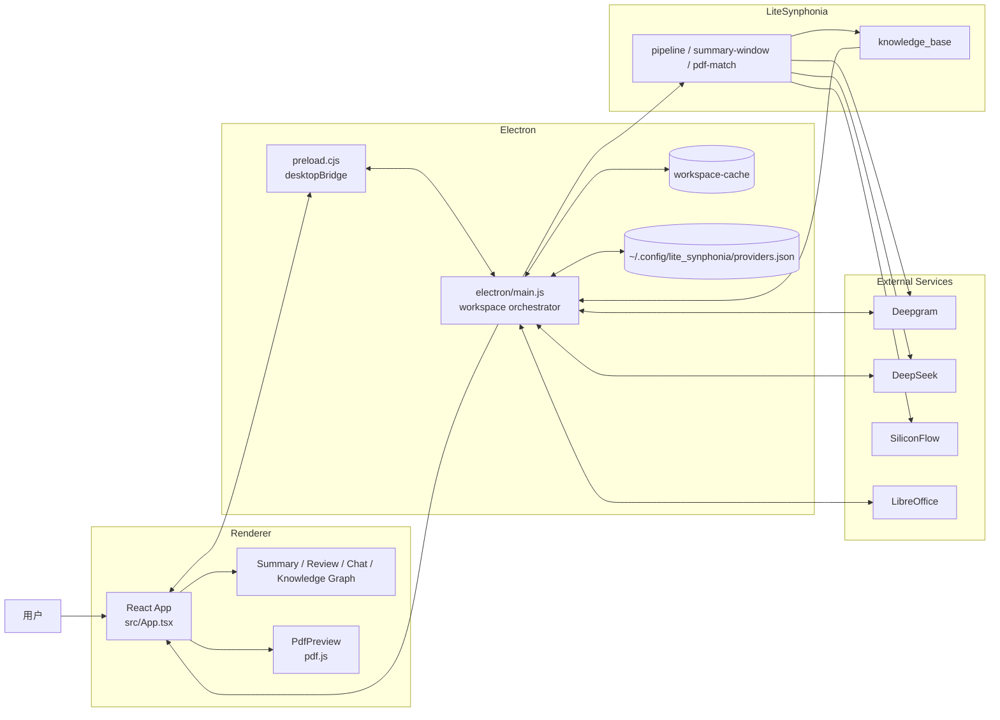

# SynPhonia

面向课堂与会议现场的应用型原型项目，聚焦流式实时转录接入、增量式总结、桌面端信息展示与知识沉淀。
https://github.com/user-attachments/assets/a7577e90-0731-483d-98da-bfa4d9d07dfa.mp4
## 项目简介

> It’s time to empower real-time voice with AI!
>
> Want to preserve the transcript of a great lecture, class, or meeting? Worried about falling behind in a session full of new ideas? No integrated AI Q&A for spoken content?
>
> Use SynPhonia! Synchronize your phone audio and PPT with AI, then structure it afterward.

想象一个并不陌生的线下场景：

老师已经讲到第三十七页 PPT，台下有人还在翻上一页的截图；会议室里刚刚抛出一个关键决策，下一秒就有人说“这个我们会后整理纪要时录入”；而“会后”通常意味着咖啡喝完、上下文蒸发、大家都坚信自己记得很清楚，但谁都不敢保证记得的是同一件事。

我们想做的不是那种“散会后再补作业”的会议总结工具，也不是把两小时长视频丢进模型里慢慢跑、等一段时间后再看结果的离线处理流水线。我们希望她能成为一个坐在教室后排、手速稳定、从不抱怨的数字助教：

- 转录内容以流的方式不断进入，保证实时内容的记录
- 总结按窗口增量刷新，把握阶段性的信息摘要
- 应用层会为 PPT 上下文、内嵌 AI 问答、知识图谱管理预留位置，帮助你更好理解和管理转录内容

换句话说，SynPhonia 关注现场正在传递的信息，并让系统跟上这一切，而不是事后再把所有内容做一次离线整理，毕竟，要点与灵感，有时就出没在信息传递与接收的一瞬。

## 项目定位

SynPhonia 面向的是课堂、讲座、培训、汇报和会议这类“内容持续产生、用户需要当场跟上节奏”的场景。

它与常见方案的区别主要在于：

- 区别于传统会议软件实时总结：
  - 重点不只是滚动生成几条 bullet，而是为应用层保留更完整的结构化数据、后续知识管理和更细粒度的信息组织能力。
- 区别于长视频离线转录总结工具：
  - 重点不是“读完整段媒体后统一处理”，而是围绕持续增长的转录文本、延迟预算和增量输出节奏来组织系统。
- 区别于单纯聊天机器人：
  - 目标不是只在最后把全文塞进一个问答框，而是让转录、总结、课件上下文和知识层能够在同一应用工作流中协同。

## 当前仓库状态

SynPhonia 是一个以桌面端为主的可运行 MVP：

- 主运行时是 `Electron + React + TypeScript`，桌面桥接定义在 `electron/preload.cjs`，核心协调逻辑集中在 `electron/main.js`
- Python 子模块 `lite_synphonia/` 负责录音管线、摘要窗口、PDF 页码匹配、知识库数据结构与 CLI 能力
- 实时能力依赖外部服务：`Deepgram` 负责转录，`DeepSeek` 负责总结和问答，`SiliconFlow` 负责 PDF 嵌入向量
- `LibreOffice` 是可选依赖，用于把 `PPT / PPTX` 转成 PDF 后统一预览
- 纯浏览器模式仍保留 `src/services/api.ts` 中的 mock 分支，主要用于界面开发；真正的数据链路在桌面端桥接中

## 功能概览

### 已实现的用户功能

- 课件工作区管理
  - 上传 `PDF / PPT / PPTX` 后自动创建缓存工作区
  - 支持恢复历史工作区、重命名、收藏、删除
- 课件预览
  - 使用 `pdf.js` 渲染 PDF
  - 支持缩放、翻页、文本层渲染与自动跳页
  - `PPT / PPTX` 可调用 LibreOffice 转换为 PDF 后预览
- 实时流式转录
  - 前端通过 `Web Audio API` 采集麦克风
  - 以 `16kHz / 单声道 / PCM16` 小片段推送到 Electron 主进程
  - 主进程维护 Deepgram WebSocket，接收 partial / final 结果并持久化
- 增量式摘要
  - 转录累计到阈值后自动触发窗口摘要
  - 静音时会做一次补刷，避免尾段内容长期挂起
- 课件页码匹配
  - 当工作区存在 PDF 时，系统会基于转录片段与课件文本做页码关联
  - 结果可反向驱动预览页跳转
- 上下文问答
  - 问答不依赖单独后端服务
  - 回答优先使用当前工作区中的 `summary.full.json`、`transcription.full.json` 和匹配到的 PDF 页面内容
- 知识库与知识图谱
  - 可从工作区产物重建活动记录
  - 提供总览、图谱、文件预览三类面板

### 代码层面的关键策略

- 实时摘要窗口参数内置在 `electron/main.js`
  - 触发阈值：`200` 个可见字符
  - 重叠窗口：`20` 个可见字符
  - 静音补刷：累计至少 `120` 个可见字符且静音超过 `8s`
- 问答会携带最近多轮对话历史，而不是单轮问答
- PDF 匹配内置 embedding 缓存，按 PDF 内容哈希和模型名复用结果
- 知识图谱关系并非手写死数据，而是根据关键词重叠、摘要文本重叠、PPT 引用、时间接近度和场景类型规则计算生成

## 架构总览



### 模块分层

| 层级 | 目录 / 文件 | 职责 |
| --- | --- | --- |
| 前端渲染层 | `src/` | 三栏界面、课件预览、工作区管理、问答、知识库面板 |
| 桥接层 | `electron/preload.cjs` | 暴露 `desktopBridge`，把 IPC 能力安全注入 renderer |
| 桌面协调层 | `electron/main.js` | 工作区缓存、Provider 配置、实时转录、PPT 转换、问答、知识库导出 |
| Python 能力层 | `lite_synphonia/` | 录音与转录、摘要窗口、PDF 匹配、知识库服务、CLI |
| 参考与样例 | `reference/`、`knowledge_base_v2_bundle_20260416/`、`tmp_kb_smoke*` | 原型参考、知识库样例、冒烟数据 |

## 技术栈

| 类别 | 实现 |
| --- | --- |
| 前端 | `React 18`、`TypeScript 6`、`Vite 5` |
| 桌面壳 | `Electron 35` |
| PDF 预览 | `pdfjs-dist` |
| 主进程通信 | Electron IPC、`ws` |
| Python 依赖 | `numpy`、`sounddevice`、`pypdf`、`opencc-python-reimplemented` |
| 转录服务 | `Deepgram` |
| 总结 / 问答 | `DeepSeek`（通过 OpenAI 兼容接口调用） |
| Embedding / 页码匹配 | `SiliconFlow` + `BAAI/bge-large-zh-v1.5` |
| PPT 转 PDF | `LibreOffice --headless` |
| 数据持久化 | JSON 文件、工作区缓存目录、知识库记录目录 |

## 核心实现细节

### 1. 实时转录链路

当前桌面端主路径优先使用实时链路：

1. `src/App.tsx` 通过 `navigator.mediaDevices.getUserMedia()` 采集麦克风
2. 音频经 `ScriptProcessorNode` 分片，转成 `PCM16`
3. `desktopBridge.pushRealtimeAudioChunk()` 把音频块送到 Electron 主进程
4. 主进程与 Deepgram WebSocket 建立会话，接收 partial / final transcript
5. final 片段会立即追加到工作区状态文件，并触发摘要窗口与页码匹配

这意味着 SynPhonia 的核心体验更接近“边说边生成结果”，而不是先完整录音再统一上传。

### 2. LiteSynphonia 的离线 / 分段管线

除了实时路径，仓库里还保留了一个可反复执行的 Python 管线入口：

- CLI 入口：`python -m lite_synphonia`
- 子命令：
  - `providers`
  - `audio-test`
  - `summary-window`
  - `pdf-match`

`electron/main.js` 中的普通管线会按工作区周期性调用：

```text
python -m lite_synphonia --activity-id <workspaceId> --output-dir <workspacePath> ...
```

管线内部主要包含：

- 音频增强：直流偏移消除、固定增益、双向 AGC、预加重、噪声门、软膝限幅
- 转录质量评估：检查内容长度、置信度、音量、削波风险、术语命中
- 摘要生成：优先走 API，总结失败时回退到启发式 summarizer
- PDF 匹配：读取 PDF 文本、分块嵌入、按时间片段做页码推断
- 输出聚合：写出 `merged_results.json` 与 `interface_output.json`

### 3. 摘要总结窗口

桌面 UI 中的“总结”不是一次性整篇总结，而是基于窗口持续增长：

- 每个窗口消费一段累计转录文本
- 相邻窗口保留重叠内容，减少语义断裂
- 新摘要会写回 `summary.full.json` 和 `.normal-mode-state.json`
- 侧栏点击某条摘要时，可以展开对应的转录片段

这套策略使它更适合课堂和会议这类正在进行中的场景。

### 4. PDF 页码匹配

`lite_synphonia/pdf_matching/` 的实现并不是简单关键词检索，而是一个偏工程化的组合方案：

- 用 `pypdf` 提取每一页文本并按长度切块
- 通过 API 生成页面块 embedding
- 对最近若干转录片段做加权聚合，形成 query embedding
- 结合 dense score、lexical score 和状态机做页码决策
- 最后再做一次全局单调平滑，减少时间线回跳

如果课件是图片型 PDF、文本无法提取，页码匹配能力会明显受限。

### 5. 知识图谱生成

知识库面板并不是读取静态图数据，而是动态从工作区结果重建：

- `exportKnowledgeBaseV2Data()` 会遍历所有工作区
- 生成活动记录后交给 `lite_synphonia.knowledge_base.service.KnowledgeBaseService`
- 关系边由 `relations.py` 根据以下规则计算：
  - 关键词重叠
  - 摘要 / 文本术语重叠
  - 同一 PPT 路径或 PPT ID
  - 时间接近度
  - 场景类型一致性

最终前端面板提供：

- 总览
- 知识图谱
- 文件预览

## 目录结构

```text
synphonia_v2/
├─ src/
│  ├─ components/             # Summary / Review / Chat / PdfPreview / KnowledgeGraphPanel
│  ├─ services/               # workspaceCache / providerSettings / mock api
│  ├─ App.tsx                 # 前端主入口
│  ├─ main.tsx
│  └─ styles.css
├─ electron/
│  ├─ main.js                 # 主进程协调器
│  └─ preload.cjs             # desktopBridge 注入
├─ lite_synphonia/
│  ├─ transcription/          # 音频采集、增强、Deepgram 客户端、质量评估
│  ├─ summarization/          # 摘要 prompt、解析器、API 客户端、窗口逻辑
│  ├─ pdf_matching/           # PDF 读取、embedding、打分、状态机
│  ├─ knowledge_base/         # 记录存储、关系构建、导出视图
│  ├─ __main__.py             # CLI 入口
│  └─ requirements.txt
├─ knowledge_base_v2_bundle_20260416/  # 知识库打包参考与测试样例
├─ reference/                           # 早期 JS 参考实现
├─ tmp_kb_smoke*                        # 知识库冒烟数据
├─ package.json
└─ README.md
```

## 工作区与产物

### 工作区模型

当前仓库采用“一个课件 = 一个工作区”的模型。工作区缓存在 Electron 的 `userData/workspace-cache` 下，真正路径由操作系统和 Electron 运行环境决定。

典型工作区内会出现这些文件：

```text
workspace/
├─ <source>.pdf / .ppt / .pptx
├─ transcription.full.json
├─ summary.full.json
├─ .normal-mode-state.json
├─ merged_results.json
├─ interface_output.json
├─ lite_synphonia.run.log
└─ 其他中间文件
```

### 文件含义

- `transcription.full.json`
  - 当前工作区的完整转录内容与元数据
- `summary.full.json`
  - 分段摘要、聚合摘要以及窗口调试信息
- `.normal-mode-state.json`
  - 前端左侧 Normal 面板直接读取的状态快照
- `merged_results.json`
  - 转录、摘要、PDF 匹配的综合结果
- `interface_output.json`
  - 面向知识库等下游模块的标准化接口输出
- `lite_synphonia.run.log`
  - Python 管线运行日志，排障时非常重要

### Provider 配置

桌面应用内的 API Key 设置最终会写入：

```text
~/.config/lite_synphonia/providers.json
```

应用当前会托管三类 provider：

- `deepgram`
- `deepseek`
- `siliconflow-embed`

## 快速开始

### 运行前准备

- 安装 `Node.js` 与 `npm`
- 安装可用的 `Python 3`
- 如需预览 `PPT / PPTX`，安装 `LibreOffice`
- 准备以下 API Key：
  - `Deepgram`
  - `DeepSeek`
  - `SiliconFlow`

### Windows

```powershell
py -3 -m venv .lite_synphonia-venv
.\.lite_synphonia-venv\Scripts\python -m pip install -r lite_synphonia\requirements.txt
npm install
npm run dev:desktop
```

### macOS / Linux

```bash
python3 -m venv .lite_synphonia-venv
./.lite_synphonia-venv/bin/python -m pip install -r lite_synphonia/requirements.txt
npm install
npm run dev:desktop
```

### 首次打开后

1. 进入桌面应用右上角设置
2. 填写 `Deepgram API Key`、`DeepSeek API Key`、`SiliconFlow API Key`
3. 选择转录语言
4. 上传 `PDF / PPT / PPTX`
5. 点击开始监听

### 构建桌面应用资源

```bash
npm run build
npm run start:desktop
```

`npm run dev:desktop` 会同时启动 Vite 开发服务器和 Electron；`npm run start:desktop` 则直接启动桌面壳并读取构建产物。

## LiteSynphonia CLI 示例

如果你想单独调试 Python 能力层，可以直接使用子模块命令：

```bash
python -m lite_synphonia providers list
python -m lite_synphonia audio-test
python -m lite_synphonia summary-window --text "这里是一段课堂转录文本"
python -m lite_synphonia pdf-match --help
```

这部分比较适合做算法调试、接口联调或单独验证某个阶段的输出。

## 当前限制与说明

- 这是一个桌面端优先的原型仓库，不是部署好的 SaaS 服务
- 无 Electron 桥接时，前端会退回 mock 上传 / mock 问答逻辑，主要用于界面调试
- `PPT / PPTX` 的预览与页码能力依赖本地 LibreOffice 转换结果
- PDF 页码匹配依赖课件文本可提取；扫描版或纯图片 PDF 效果会受限
- 项目目前没有统一的 `npm test` 或根级 `pytest` 入口
- 现有测试主要集中在知识库相关模块，例如：
  - `lite_synphonia/tests/test_knowledge_base.py`
  - `knowledge_base_v2_bundle_20260416/tests/knowledge_base/test_service.py`

## 适合谁关注这个项目

如果你关心以下方向，这个仓库会比较有参考价值：

- 课堂 / 会议场景下的实时 AI 辅助
- Electron 桌面应用如何与 Python 能力层协作
- 基于工作区产物做问答与知识沉淀
- Transcript-to-slide matching 的工程落地方式
- 从实时转录逐步演化到知识图谱的产品路径
